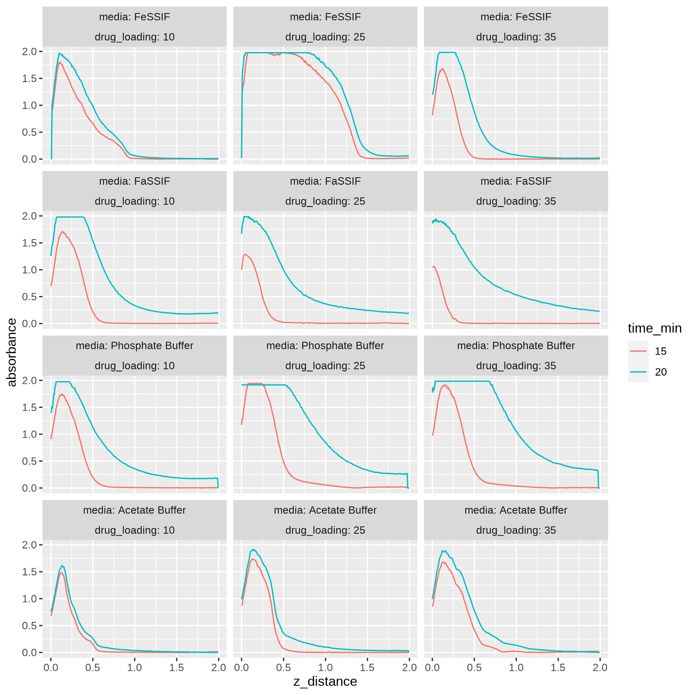
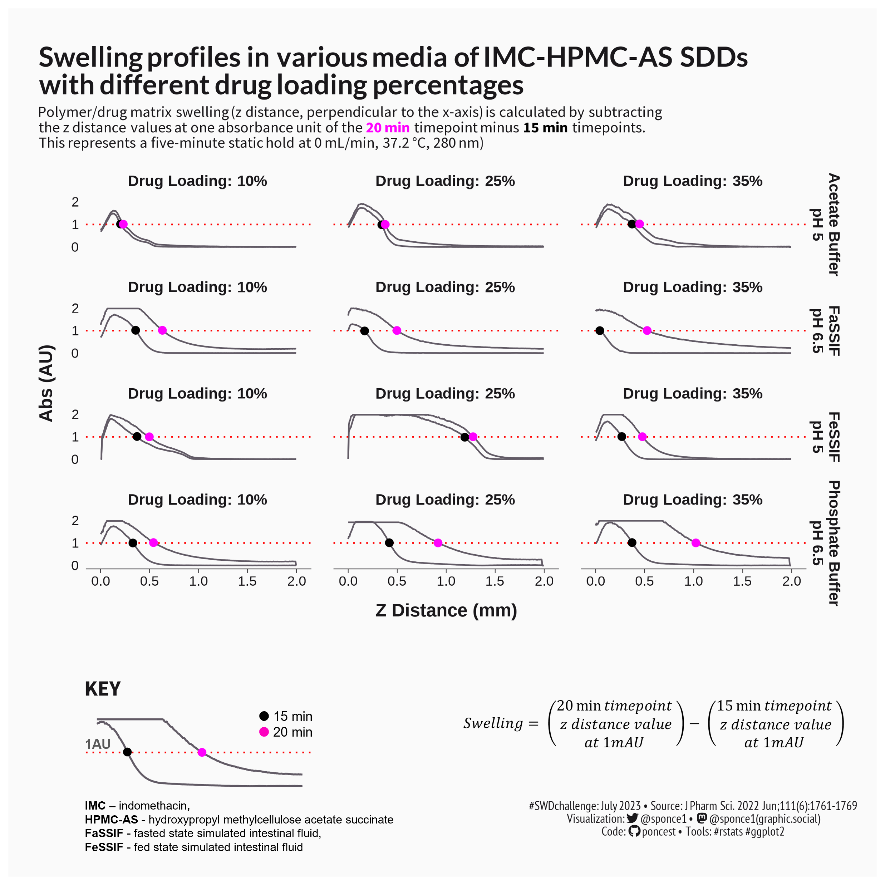

## Version 1:
The assumption is that the audience knows the topic/subject well. 
Ideal for exploratory data analysis. Quick plot for project team meetings.

## Version 2:
The assumption is that the audience does not know the topic/subject well. 

