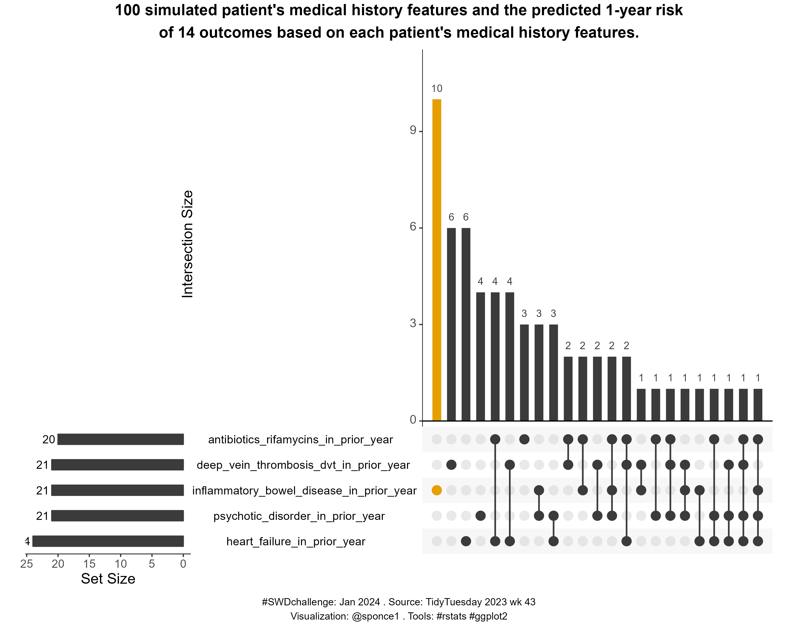

# \#**SWDchallenge**

<!-- table header, followed by pictures link -->

|                   [January](https://github.com/poncest/SWDchallenge/tree/main/2024/01_Jan)[ ](https://github.com/poncest/tidytuesday/tree/main/2023/Week_02)[Upskill with UpSets](https://github.com/poncest/SWDchallenge/tree/main/2024/01_Jan)                    |
|:----------------------------------------------------------------------:|
|                                                                                                                                                                                                                                        |
|                                                                                   [March Design for accessibility](https://github.com/poncest/SWDchallenge/tree/main/2024/03_Mar)                                                                                   |
|                                                                                                                                                                                                                                        |
|             [March Exercise](https://github.com/poncest/SWDchallenge/tree/main/2024/Ex_3.10)[ ](https://github.com/poncest/SWDchallenge/tree/main/2024/03_Mar)[remove the unessential](https://github.com/poncest/SWDchallenge/tree/main/2024/Ex_3.10)              |
|                                                                                                                                                                                                                                      |
|                      [April](https://github.com/poncest/SWDchallenge/tree/main/2024/04_Apr)[ ](https://github.com/poncest/SWDchallenge/tree/main/2024/03_Mar)[Napoleon's April](https://github.com/poncest/SWDchallenge/tree/main/2024/04_Apr)                      |
|                                                                                                                                                                                                                                        |
|                   [May](https://github.com/poncest/SWDchallenge/tree/main/2024/05_May)[ ](https://github.com/poncest/SWDchallenge/tree/main/2024/03_Mar)[when every point matters](https://github.com/poncest/SWDchallenge/tree/main/2024/05_May)                   |
|                                                                                                                                                                                                                                        |
| [May Exercise](https://github.com/poncest/SWDchallenge/tree/main/2024/Ex_bold_backgroud)[ ](https://github.com/poncest/SWDchallenge/tree/main/2024/03_Mar)[graphing on a bold background](https://github.com/poncest/SWDchallenge/tree/main/2024/Ex_bold_backgroud) |
|                                                                                                                                                                                                        |
|                     [June](https://github.com/poncest/SWDchallenge/tree/main/2024/06_Jun)[ ](https://github.com/poncest/SWDchallenge/tree/main/2024/03_Mar)[make a funnel chart](https://github.com/poncest/SWDchallenge/tree/main/2024/06_Jun)                     |
|                                                                                                                                                                                                                                       |
|                [June Exercise](https://github.com/poncest/SWDchallenge/tree/main/2024/Ex_051)[ ](https://github.com/poncest/SWDchallenge/tree/main/2024/03_Mar)[make the point clear](https://github.com/poncest/SWDchallenge/tree/main/2024/Ex_051)                |
|                                                                                                                                                                                                                                              |
|                  [August](https://github.com/poncest/SWDchallenge/tree/main/2024/08_aug)[ ](https://github.com/poncest/SWDchallenge/tree/main/2024/03_Mar)[visualize the Olympics](https://github.com/poncest/SWDchallenge/tree/main/2024/08_Aug)                   |
|                                                                                                                                                                                                                                     |
