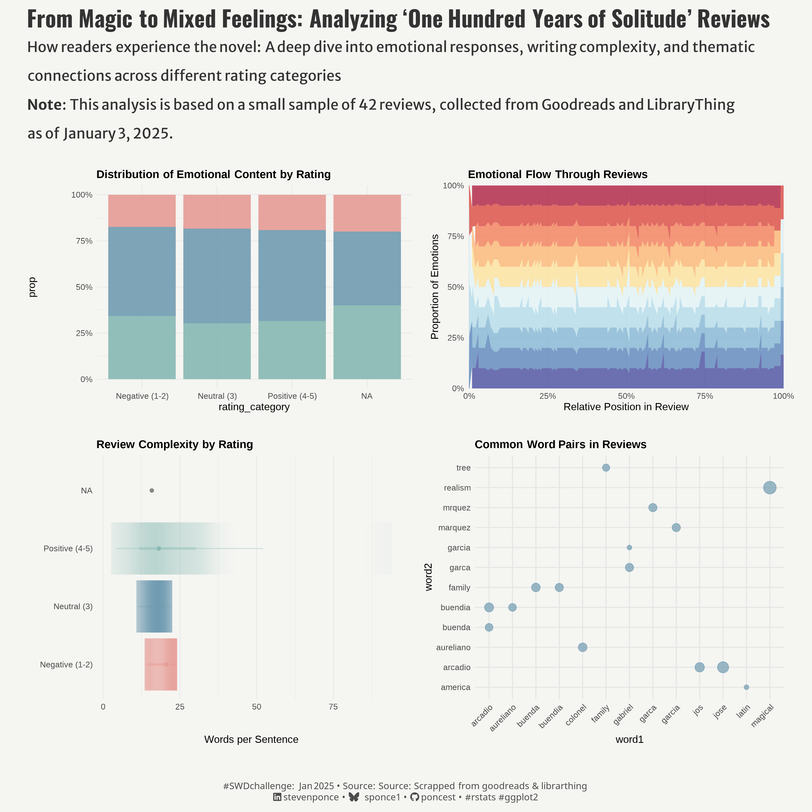
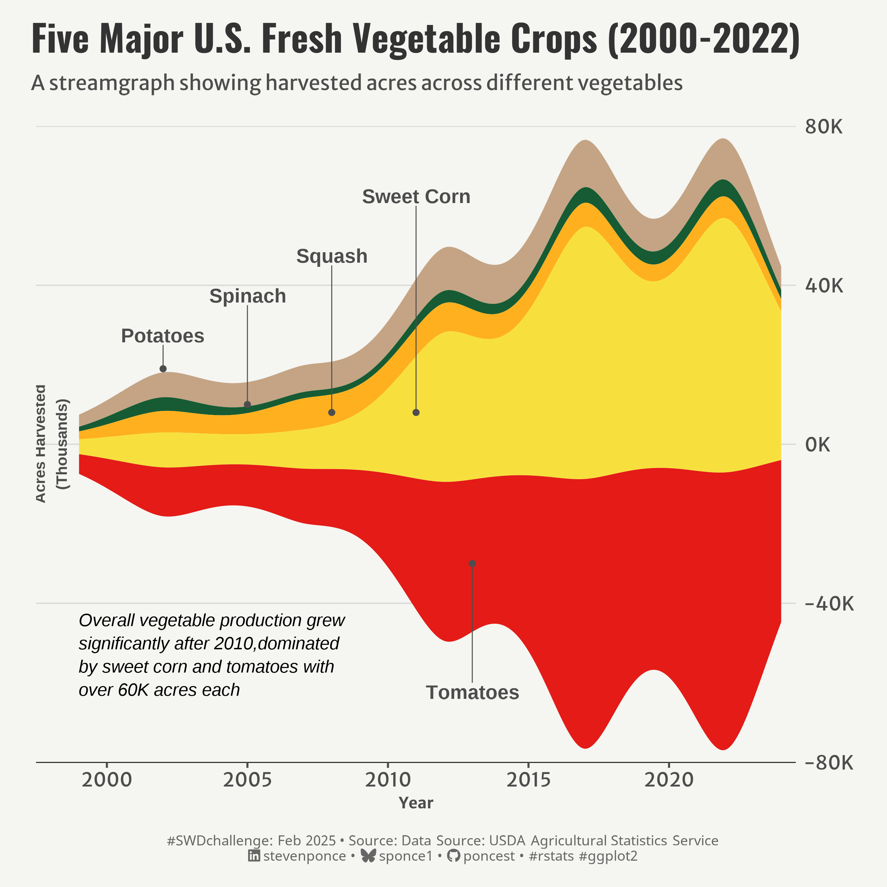

# \#**SWDchallenge**

<!-- table header, followed by pictures link -->

| [January](https://github.com/poncest/SWDchallenge/tree/main/2025/01_Jan)[ ](https://github.com/poncest/tidytuesday/tree/main/2023/Week_02)[visualize qualitative data](https://github.com/poncest/SWDchallenge/tree/main/2025/01_Jan) |
|:----------------------------------------------------------------------:|
|  |
| [January Exercise](https://github.com/poncest/SWDchallenge/tree/main/2025/Ex_037)[ ](https://github.com/poncest/tidytuesday/tree/main/2023/Week_02)[use space and alignment effectively](https://github.com/poncest/SWDchallenge/tree/main/2025/Ex_037) |
|  |
| [February](https://github.com/poncest/SWDchallenge/tree/main/2025/02_Feb)[ ](https://github.com/poncest/tidytuesday/tree/main/2023/Week_02)[reclaim the streamgraph](https://github.com/poncest/SWDchallenge/tree/main/2025/02_Feb) |
|  |
|  |
|  |
