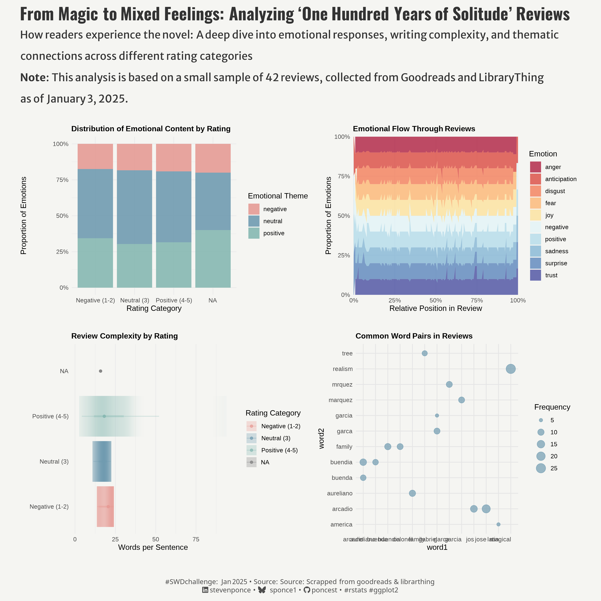
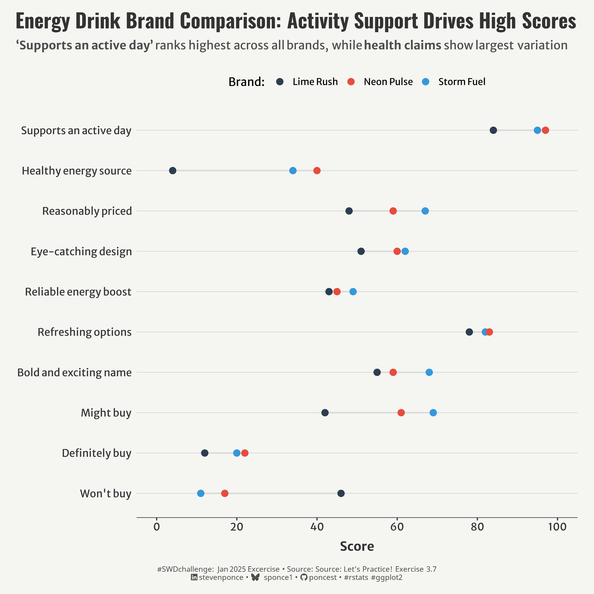

# \#**SWDchallenge**

<!-- table header, followed by pictures link -->

| [January](https://github.com/poncest/SWDchallenge/tree/main/2025/01_Jan)[ ](https://github.com/poncest/tidytuesday/tree/main/2023/Week_02)[visualize qualitative data](https://github.com/poncest/SWDchallenge/tree/main/2025/01_Jan) |
|:--:|
|  |
| [January Exercise](https://github.com/poncest/SWDchallenge/tree/main/2025/Ex_037)[ ](https://github.com/poncest/tidytuesday/tree/main/2023/Week_02)[use space and alignment effectively](https://github.com/poncest/SWDchallenge/tree/main/2025/Ex_037) |
|  |
| [February](https://github.com/poncest/SWDchallenge/tree/main/2025/02_Feb)[ ](https://github.com/poncest/tidytuesday/tree/main/2023/Week_02)[reclaim the streamgraph](https://github.com/poncest/SWDchallenge/tree/main/2025/02_Feb) |
|  |
| [February Exercise](https://github.com/poncest/SWDchallenge/tree/main/2025/Ex_055)[ ](https://github.com/poncest/tidytuesday/tree/main/2023/Week_02)[go crazy or keep it simple](https://github.com/poncest/SWDchallenge/tree/main/2025/Ex_055) |
|  |
| [March](https://github.com/poncest/SWDchallenge/tree/main/2025/03_Mar)[ ](https://github.com/poncest/tidytuesday/tree/main/2023/Week_02)[present disappointing results](https://github.com/poncest/SWDchallenge/tree/main/2025/03_Mar) |
|  |
| [March Exercise](https://github.com/poncest/SWDchallenge/tree/main/2025/Ex_056)[ ](https://github.com/poncest/tidytuesday/tree/main/2023/Week_02)[resist the temptation to show all the data](https://github.com/poncest/SWDchallenge/tree/main/2025/Ex_056) |
|  |
| [May](https://github.com/poncest/SWDchallenge/tree/main/2025/05_May)[ ](https://github.com/poncest/tidytuesday/tree/main/2023/Week_02)[compare human and machine](https://github.com/poncest/SWDchallenge/tree/main/2025/05_May) |
|  |
| [May Exercise](https://github.com/poncest/SWDchallenge/tree/main/2025/Ex_058)[ ](https://github.com/poncest/tidytuesday/tree/main/2023/Week_02)[which chart shows it best?](https://github.com/poncest/SWDchallenge/tree/main/2025/Ex_058) |
|  |
| [June](https://github.com/poncest/SWDchallenge/tree/main/2025/06_Jun)[ ](https://github.com/poncest/tidytuesday/tree/main/2023/Week_02)[transform a graph](https://github.com/poncest/SWDchallenge/tree/main/2025/06_Jun) |
|  |
| [July](https://github.com/poncest/SWDchallenge/tree/main/2025/07_Jul)[ ](https://github.com/poncest/tidytuesday/tree/main/2023/Week_02)[find the right level of detail](https://github.com/poncest/SWDchallenge/tree/main/2025/07_Jul) |
|  |
| [July](https://github.com/poncest/SWDchallenge/tree/main/2025/Ex_July)[ ](https://github.com/poncest/tidytuesday/tree/main/2023/Week_02)[visualize a multi-dimensional data table](https://github.com/poncest/SWDchallenge/tree/main/2025/Ex_July) |
|  |
| [August](https://github.com/poncest/SWDchallenge/tree/main/2025/08_Aug)[ ](https://github.com/poncest/tidytuesday/tree/main/2023/Week_02)[style guides](https://github.com/poncest/SWDchallenge/tree/main/2025/08_Aug) |
|  |
| [September](https://github.com/poncest/SWDchallenge/tree/main/2025/09_Sep)[ ](https://github.com/poncest/tidytuesday/tree/main/2023/Week_02)[dashboards that deliver](https://github.com/poncest/SWDchallenge/tree/main/2025/09_Sep) |
|  |
| [October](https://github.com/poncest/SWDchallenge/tree/main/2025/10_Oct)[ ](https://github.com/poncest/tidytuesday/tree/main/2023/Week_02)[avoid the spaghetti graph](https://github.com/poncest/SWDchallenge/tree/main/2025/10_Oct) |
|  |
| [November](https://github.com/poncest/SWDchallenge/tree/main/2025/11_Nov)[ ](https://github.com/poncest/tidytuesday/tree/main/2023/Week_02)[discover the dot plot](https://github.com/poncest/SWDchallenge/tree/main/2025/11_Nov) |
|  |
| [December](https://github.com/poncest/SWDchallenge/tree/main/2025/12_Dec)[ ](https://github.com/poncest/tidytuesday/tree/main/2023/Week_02)[when less is better](https://github.com/poncest/SWDchallenge/tree/main/2025/12_Dec) |
|  |
|  |
