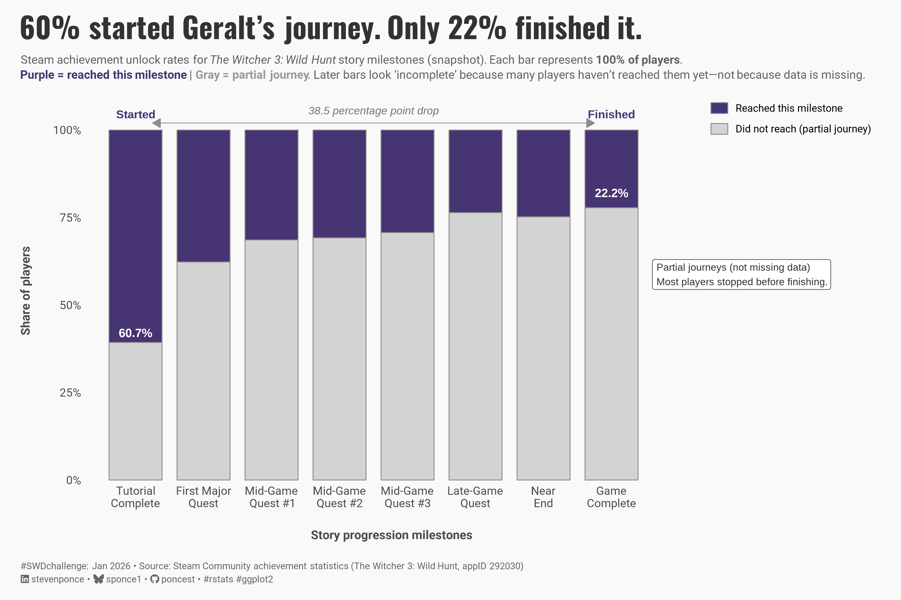
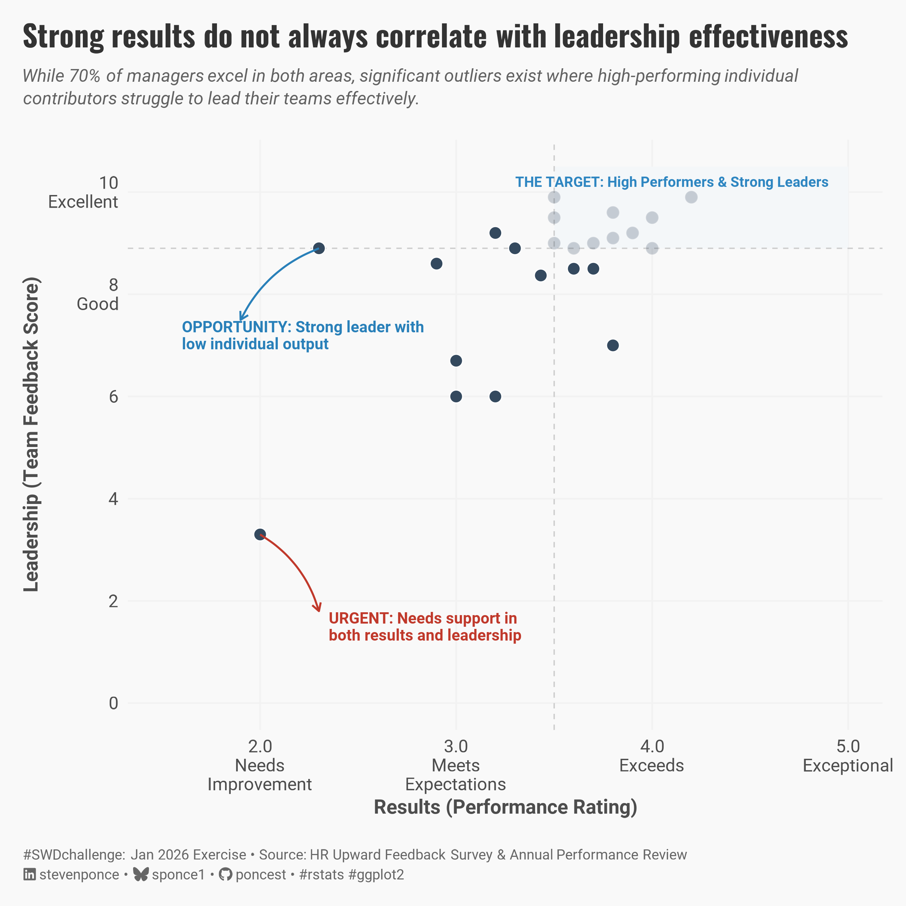
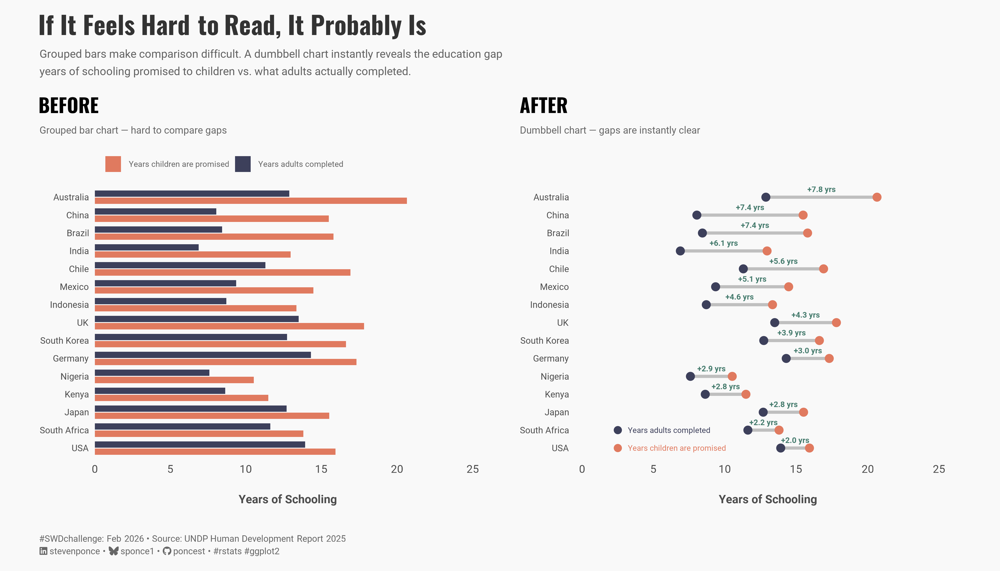

# \#**SWDchallenge**

<!-- table header, followed by pictures link -->

| [January](https://github.com/poncest/SWDchallenge/tree/main/2026/01_Jan)[ ](https://github.com/poncest/tidytuesday/tree/main/2023/Week_02)[plot partial information](https://github.com/poncest/SWDchallenge/tree/main/2026/01_Jan) |
|:----------------------------------------------------------------------:|
|  |
| [January Exercise](https://github.com/poncest/SWDchallenge/tree/main/2026/Ex_001)[ ](https://github.com/poncest/tidytuesday/tree/main/2023/Week_02)[presenting a scatterplot](https://github.com/poncest/SWDchallenge/tree/main/2026/Ex_001) |
|  |
| [February](https://github.com/poncest/SWDchallenge/tree/main/2026/02_Feb)[ ](https://github.com/poncest/tidytuesday/tree/main/2023/Week_02)[share your favorite SWD tip](https://github.com/poncest/SWDchallenge/tree/main/2026/02_Feb) |
|  |
|  |
|  |
|  |
|  |
|  |
|  |
|  |
|  |
|  |
|  |
|  |
|  |
|  |
|  |
|  |
|  |
|  |
|  |
|  |
|  |
|  |
|  |
|  |
|  |
|  |
|  |
|  |
